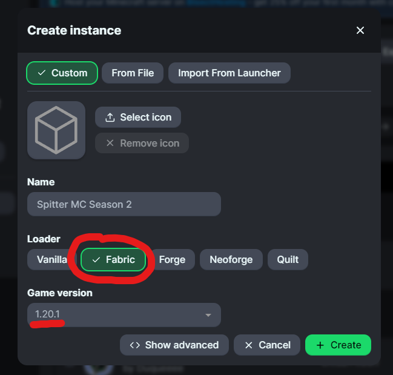

# THE SERVER HAS NOT RELEASED YET - THIS INFORMATION IS INCOMPLETE

{: .warning }
**Make sure you have either completed the modloader setup [on the previous page](https://spitter.space/mc-info/loader-install), or you have a Fabric 1.20.1 profile already setup!**

## Using the Modrinth .mrpack mod installation (Very Easy!)
Modrinth Install
{: .label .label-green }

If you installed Modrinth, it's really easy to get your mods setup. Clicking [this](/mc) will download the latest .mrpack or zip file. 

Then, click the green plus button at the bottom left of your Modrinth App window. Click on the Fabric loader option and select the game version as Minecraft 1.20.1 (see the image below for guidance)

You can either import the .mrpack file or manually install it from the zip file. The direct Modrinth file installation is less prone to breaking, so I **highly** advise doing it that way.

If you're installing it with the .mrpack file, just click the "From File" button. Done!

If you're installing it manually, copy and paste the mods from the zip file into the mods folder for Minecraft - click the "open folder" button in Modrinth to easily get access.

So, now you're completely ready to go. Follow [this link to read how to connect to the server!](https://spitter.space/mc-info/connecting)

## Manual install to your mods folder (slightly harder)
Fabric Manual Install
{: .label .label-yellow }

If you installed Fabric manually, all you need to do is to download the zip file from [here](/mc).

You then need to extract it using the right click menu in your file manager of choice.

Now, open your profile folder from the Minecraft launcher, and open the Mods folder within. 

Drag or copy the .jar files from the unzipped folder into the mods folder. 

{: .warning }
Do not drag the whole folder itself in, just the .jar files that are inside the folder need to be copied!

Now try launching your Minecraft instance. If it loads and you can see the Mod Menu button and/or the Fabric (x amount of mods) text on the bottom left, you're good to go!
Follow [this link to read how to connect to the server!](https://spitter.space/mc-info/connecting)
